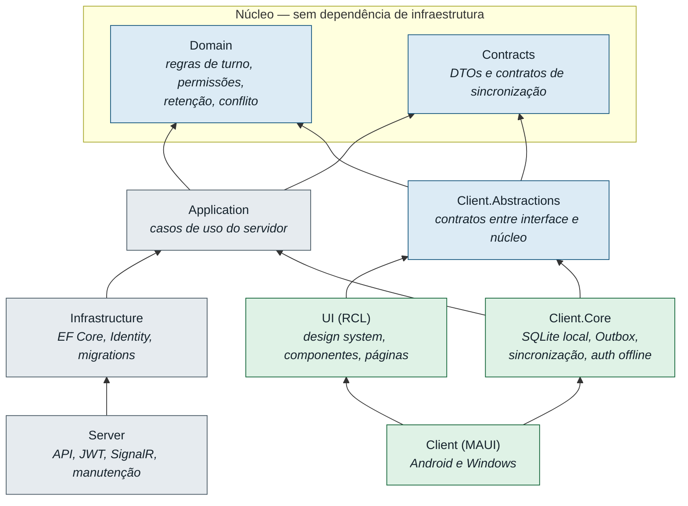

# Arquitetura

## Visão geral

```
        ┌──────────────────────────┐        ┌──────────────────────────┐
        │  Aparelho Android        │        │  Computador Windows      │
        │  MAUI Blazor Hybrid      │        │  MAUI Blazor Hybrid      │
        │  ┌────────────────────┐  │        │  ┌────────────────────┐  │
        │  │ RCL compartilhada  │  │        │  │ RCL compartilhada  │  │
        │  ├────────────────────┤  │        │  ├────────────────────┤  │
        │  │ SQLite local +     │  │        │  │ SQLite local +     │  │
        │  │ fila de envio      │  │        │  │ fila de envio      │  │
        │  └────────────────────┘  │        │  └────────────────────┘  │
        └───────────┬──────────────┘        └───────────┬──────────────┘
                    │  HTTPS (push/pull) + SignalR (avisos)
                    └──────────────┬─────────────────────┘
                                   ▼
                    ┌──────────────────────────────┐
                    │  ChecklistPlantao.Server     │
                    │  API · JWT · SignalR · Health│
                    │  SQLite central (volume)     │
                    └──────────────────────────────┘
```

Os aparelhos **nunca** tocam o arquivo SQLite central: todo acesso passa pela API.

## Camadas e dependências

Todas as setas apontam para dentro. `Domain` não conhece ninguém — é o que permite testar turno,
permissões e conflito sem banco, sem HTTP e sem MAUI.



Três consequências que o diagrama torna visíveis:

- **`Identity` para em `Infrastructure`.** O aplicativo nunca carrega
  `Microsoft.AspNetCore.Identity`, e o hash de senha do servidor não tem como chegar ao aparelho
  (D-005).
- **A RCL não conhece EF Core, HttpClient nem MAUI.** É o que permite testá-la com bUnit contra
  duplos simples.
- **`Client.Core` não depende da `UI`.** Os contratos que ele implementa vivem em
  `Client.Abstractions`, fora da camada de apresentação (D-023). Só o head MAUI junta os dois lados.

Três escolhas merecem explicação:

**A RCL não referencia Application.** Se referenciasse, a interface arrastaria EF Core. Em vez
disso a RCL **declara** as abstrações de que precisa (`IAppSession`, `IChecklistStore`,
`ISyncStatusService`…) e o `Client.Core` as implementa. Inversão de dependência aplicada onde ela
realmente paga: a interface fica testável com bUnit contra duplos simples.

**Infrastructure não é alcançável pelo cliente.** Identity fica confinado ao servidor, e o
aplicativo Android não carrega `Microsoft.AspNetCore.Identity`. O hash de senha nunca tem como
chegar ao aparelho.

**Application referencia EF Core.** Sem isso seria preciso um repositório por consulta — a
abstração inútil que o próprio enunciado proíbe. O que Application vê é `IAppDataContext`, a
superfície reduzida do contexto. Consultas que o provedor relacional não traduz ficam em
Infrastructure, atrás de métodos da interface.

## Onde cada regra vive

| Regra | Onde | Por quê |
|---|---|---|
| Turno atravessando meia-noite | `Domain/Scheduling/ShiftWindow` | Servidor e cliente precisam do mesmo cálculo |
| União de permissões por grupo | `Domain/Access/EffectiveAccess` | Idem |
| "Conclusão vence" | `Domain/Sync/MergePolicies` | O cliente precisa prever o que o servidor fará |
| Retenção | `Domain/Settings/RetentionPolicy` | Regra de negócio, não de infraestrutura |
| Quando alertar | `Domain/Scheduling/NotificationPlanner` | Cálculo puro, testável sem plataforma |
| Aplicar marcação com conflito | `Application/Checklist/ChecklistMutationService` | Caminho único de escrita: REST e sync convergem |
| Cursor e idempotência | `Infrastructure/Persistence/AppDbContext` | Consultas que exigem o provedor relacional |

Nada de regra de negócio em controller. Controllers traduzem HTTP e delegam.

## Duas configurações de EF Core

O servidor tem `AppDbContext` (SQLite central + Identity + log de alterações). O aparelho tem
`LocalDbContext` (SQLite local + fila + credenciais + estado do dispositivo).

**As entidades de domínio são as mesmas nos dois.** Um `Bed` é um `Bed`, com as mesmas regras.
Muda o que é específico de cada lado.

## Fluxo de uma marcação

```
Toque → célula muda na tela
      → estado local + item da fila, na mesma transação
      → (quando houver servidor) push
      → servidor aplica ou resolve conflito
      → resposta adotada; item sai da fila
      → SignalR avisa os outros aparelhos
      → eles fazem pull
```

Nenhum passo depois do primeiro bloqueia a interface.

## Serviços de fundo

**Servidor** (`MaintenanceHostedService`, a cada 30 min): retenção das sessões, poda do log de
alterações e das operações idempotentes, limpeza de refresh tokens expirados, marcação de
dispositivos sem contato.

**Cliente**: sincronização em eventos (abertura, login, volta ao primeiro plano, retorno de rede,
aviso do hub, toque manual) e reagendamento de notificações após cada sincronização. Sem laços
apertados e sem timers agressivos — o requisito é explícito sobre bateria.

## Estratégia de testes

| Projeto | O que valida | Contra o quê |
|---|---|---|
| Domain.Tests | Regras puras | Nada — sem I/O |
| Application.Tests | Casos de uso | SQLite em memória, esquema real |
| Client.Core.Tests | Offline, fila, conflito, agenda | SQLite em **arquivo** e servidor de mentira |
| Server.IntegrationTests | API de ponta a ponta | Servidor real, SQLite temporário |
| UI.Tests | Componentes | bUnit + duplos de teste |

Client.Core.Tests usa arquivo, e não `:memory:`, de propósito: só assim é possível fechar o
contexto e abrir outro sobre o mesmo banco — o equivalente a fechar e reabrir o aplicativo. Com
banco em memória o teste não provaria nada sobre persistência.
