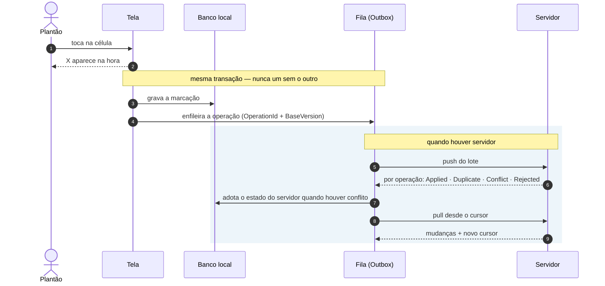

# Sincronização offline-first

## Princípio

O aparelho é a fonte de verdade enquanto está sem servidor. A interface **nunca** espera a rede
para responder a um toque.

Toda marcação segue o mesmo caminho:

1. a célula muda na tela (atualização otimista);
2. o estado local e o item da fila são gravados **na mesma transação**;
3. a fila é enviada quando houver servidor;
4. o resultado do servidor é adotado — inclusive quando é um conflito;
5. a tela só reverte se a gravação **local** falhar.

O passo 2 é o que sustenta tudo: não existe momento em que a tela mostre a marcação e a fila não
tenha o item, nem o contrário. Ver `OutboxWriter`.

Sem servidor, o ciclo da caixa simplesmente não acontece — e nada no bloco de cima muda. É por isso
que marcar funciona igual com ou sem rede.

## Fila de envio (Outbox)

Cada item carrega:

| Campo | Para quê |
|---|---|
| `OperationId` | Identidade estável da operação — base da idempotência |
| `EntityType`, `EntityId` | O que foi alterado |
| `Payload` | Estado desejado, em JSON |
| `BaseVersion` | Versão que o aparelho via quando o usuário alterou |
| `RetryCount`, `NextAttemptAtUtc` | Espera crescente entre tentativas |
| `Status` | Pending · InFlight · Failed · Done |

Itens concluídos são removidos: manter tudo faria o banco do aparelho crescer sem limite.

## Cursor

O servidor mantém um log de alterações com sequência crescente (`LogAlteracoes`). O aparelho guarda
a última sequência que viu e pede apenas o que veio depois.

Se o cursor local for anterior ao início do log — porque a retenção já podou aquele trecho — o
servidor responde `RequiresBootstrap` e o aparelho refaz a carga completa. É a recuperação para um
aparelho que ficou semanas desligado.

## Idempotência

O servidor grava cada `OperationId` processado em `OperacoesProcessadas`. Reenviar a mesma operação
devolve `Duplicate` e **não aplica nada de novo**.

Isso importa porque o caso comum de falha não é "a operação não chegou", e sim "a operação chegou
mas a confirmação se perdeu na volta". Sem idempotência, o reenvio dobraria a alteração.

## Conflitos

### Marcação do checklist — conclusão vence

| Servidor | Pedido | Versão-base | Resultado |
|---|---|---|---|
| qualquer | igual ao servidor | qualquer | `NoChange` (sucesso idempotente) |
| desmarcado | marcar | qualquer | `Applied` |
| marcado | desmarcar | atual | `Applied` |
| marcado | desmarcar | **defasada** | `Conflict` — a conclusão permanece |

A assimetria é deliberada. Marcar é a operação que o plantão não pode perder; uma operação antiga
feita offline **nunca** apaga silenciosamente uma conclusão mais nova. Se o usuário realmente
precisa desmarcar, ele atualiza a tela e refaz — com a versão atual, funciona.

O aparelho adota o estado do servidor **sem mensagem técnica**: quem está no plantão não precisa
saber o que é versão-base.

### Configuração administrativa — versão manda

Sem "vencedor" preferencial. Versão defasada é recusada, o estado atual volta e o administrador é
avisado em linguagem clara para atualizar a tela e refazer.

### Classificações de leito — versão manda

Mesma regra da configuração, com mensagem simples ao usuário.

Todos esses casos têm teste automatizado, em `MergePoliciesTests`, `SyncTests` e `SyncEngineTests`.

## Quando o aparelho sincroniza

- ao abrir o aplicativo;
- depois do login;
- ao voltar para o primeiro plano;
- após uma alteração, se houver servidor;
- quando a conectividade retorna;
- quando o hub SignalR avisa que há novidade;
- quando o usuário toca em "Sincronizar agora".

Não há laço apertado. Falha agenda nova tentativa com espera dobrando a cada erro (15 s → teto de
30 min) mais um jitter de até 20 %, que evita todos os aparelhos do plantão tentarem no mesmo
instante quando a rede volta.

## SignalR

O hub **apenas avisa** que existe algo novo. Nunca transporta estado.

A razão é robustez: uma mensagem perdida não gera divergência — na pior hipótese o aparelho
descobre a novidade no próximo ciclo. Se o hub fosse fonte de verdade, uma reconexão mal
sincronizada produziria telas diferentes em aparelhos diferentes.

As conexões são agrupadas por setor e por usuário, e a autorização é reavaliada no hub: um cliente
não escolhe sozinho em qual setor se inscrever.

No cliente, quem mantém a conexão é o `RealtimeSyncClient`: acompanha o estado da sessão, conecta
quando há usuário autenticado e endereço de servidor, e reconecta sozinho. Cada aviso recebido
dispara a mesma sincronização dos demais gatilhos.

Ele **chama `SubscribeSector` ao entrar no setor**, e isso não é redundante: a inscrição automática
da conexão usa apenas os setores explícitos do usuário, e quem tem acesso a todos — o grupo
Administradores, semeado com `GrantsAllSectors` e nenhum setor nominal — não entraria em grupo
nenhum. Sem essa chamada, justamente o administrador ficaria sem aviso.

O token é buscado a cada tentativa de conexão, e não guardado: o SignalR pede de novo em cada
reconexão, e um token vencido deixaria o aparelho mudo.

## Os três níveis de conectividade

O enunciado exige distinguir, e o sistema distingue:

| Estado | Significado | O que a interface diz |
|---|---|---|
| `Offline` | Sem rede nenhuma | "Offline — N alterações aguardando" |
| `ServerUnreachable` | Há rede, servidor não responde | "Servidor indisponível — as alterações estão salvas neste dispositivo" |
| `LocalNetwork` | Servidor acessível, sem internet | "Tudo sincronizado — conectado pela rede local" |
| `Online` | Servidor acessível e internet | "Tudo sincronizado" |

Sem internet externa o sistema funciona **integralmente**, desde que o servidor esteja na rede local.
